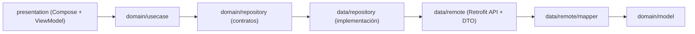

# MyDiscsCollection

Aplicación Android (Jetpack Compose) para buscar artistas en Discogs, ver su detalle y explorar su discografía con filtros por año, género y sello.

## Tabla de contenido

1. [Objetivo](#objetivo)
2. [Funciones principales](#funciones-principales)
3. [Referencia de diseño](#referencia-de-diseño)
4. [Stack tecnológico](#stack-tecnológico)
5. [Arquitectura](#arquitectura)
6. [Estructura del proyecto](#estructura-del-proyecto)
7. [Configuración del proyecto](#configuración-del-proyecto)
8. [Ejecución](#ejecución)
9. [Pruebas unitarias](#pruebas-unitarias)
10. [Proceso de análisis y desarrollo](#proceso-de-análisis-y-desarrollo)
11. [Buenas prácticas, clean code y patrones](#buenas-prácticas-clean-code-y-patrones)
12. [Decisiones técnicas y trade-offs](#decisiones-técnicas-y-trade-offs)
13. [Deuda técnica y mejoras recomendadas](#deuda-técnica-y-mejoras-recomendadas)
14. [Troubleshooting](#troubleshooting)

## Objetivo

Construir una app de catálogo musical enfocada en:

- Búsqueda de artistas con paginación.
- Pantalla de detalle del artista.
- Pantalla de discografía con filtros combinables.
- Estados de UI claros: `Loading`, `Success`, `Empty`, `Error`.

## Funciones principales

- Búsqueda reactiva con debounce en `SearchViewModel`.
- Lista de artistas con paginación incremental (infinite scroll).
- Vista de detalle con biografía, imagen y miembros de banda.
- Vista de discografía con filtros por año, género y sello.
- Orden de álbumes de más reciente a más antiguo usando la fecha exacta de lanzamiento cuando Discogs la expone.
- Skeleton loading y estados de feedback reutilizables.

## Referencia de diseño

- Figma público del challenge: [Vew diseño en Figma](https://www.figma.com/design/3hh2ALPGzZeYEVhoedCFR1/Sin-t%C3%ADtulo?node-id=0-1&t=yzQp7trrIzXrSW89-1)

## Stack tecnológico

- **Lenguaje**: Kotlin `2.2.21`
- **UI**: Jetpack Compose + Material 3
- **Arquitectura UI**: MVVM
- **DI**: Hilt (`@HiltViewModel`, `@AndroidEntryPoint`, módulos `@InstallIn(SingletonComponent::class)`)
- **Networking**: Retrofit `2.11.0` + OkHttp `4.12.0`
- **Serialización**: Moshi `1.15.2` + `converter-moshi`
- **Imágenes**: Coil 3 (`coil-compose`, `coil-network-okhttp`)
- **Concurrencia**: Kotlin Coroutines + `StateFlow`
- **Navegación**: Navigation Compose `2.9.7`
- **Testing**: JUnit4, MockK, Turbine, `kotlinx-coroutines-test`

Versiones relevantes del proyecto:

- Android Gradle Plugin: `8.13.2`
- Gradle Wrapper: `8.13`
- `compileSdk` / `targetSdk`: `36`
- `minSdk`: `24`

## Arquitectura

El proyecto sigue una separación por capas estilo **Clean Architecture + MVVM**.



### Capas

- **presentation**
  - Pantallas Compose (`SearchScreen`, `ArtistDetailScreen`, `DiscographyScreen`)
  - `ViewModel` por feature
  - `UiState` sellados para modelar estados de pantalla
- **domain**
  - Entidades de negocio (`Artist`, `ArtistDetail`, `Release`)
  - Casos de uso (`SearchArtistsUseCase`, `GetArtistDetailUseCase`, `GetArtistReleasesUseCase`)
  - Contrato de repositorio (`ArtistRepository`)
- **data**
  - Cliente API (`DiscogsApiService`)
  - DTOs
  - Mappers DTO -> dominio (`ArtistMapper`)
  - Implementación del repositorio (`ArtistRepositoryImpl`)

### Razonamiento de arquitectura

- Mantener la UI desacoplada de Retrofit/DTOs facilita testeo y cambios de proveedor.
- Casos de uso explícitos centralizan reglas de negocio por feature.
- Repository pattern abstrae el origen de datos y mejora mantenibilidad.
- `StateFlow` + `UiState` sellados evitan estados ambiguos en Compose.

## Estructura del proyecto

```text
app/src/main/java/com/example/mydiscscollection
├── data
│   ├── remote
│   │   ├── dto
│   │   ├── mapper
│   │   └── DiscogsApiService.kt
│   └── repository
├── domain
│   ├── model
│   ├── repository
│   └── usecase
├── di
├── navigation
├── presentation
│   ├── search
│   ├── detail
│   ├── discography
│   └── components
└── ui/theme
```

## Configuración del proyecto

### Requisitos

- Android Studio (recomendado: versión reciente estable)
- JDK 17 para ejecutar Gradle/AGP 8.x
- Android SDK 36
- Emulador o dispositivo con Android 7.0+ (API 24+)

### Instalación

```bash
git clone <URL_DEL_REPO>
cd MyDiscsCollection
```

Abrir el proyecto en Android Studio y sincronizar Gradle.

### Configuración de API Discogs

Estado actual del repo:

- Las credenciales de Discogs están definidas en:
  - `app/src/main/java/com/example/mydiscscollection/di/AppModule.kt`

Para configurar tus propias credenciales:

1. Crea tu app en Discogs y obtén `consumer key` y `consumer secret`.
2. Reemplaza las constantes del módulo DI por tus valores.
3. No publiques secretos en git.

Recomendación de seguridad (pendiente de implementar en código):

- Mover secretos a `local.properties` + `buildConfigField`.
- Consumirlos desde `BuildConfig` en lugar de hardcodearlos.

## Ejecución

### Compilar debug

```bash
./gradlew assembleDebug
```

### Instalar en dispositivo/emulador

```bash
./gradlew installDebug
```

### Ejecutar desde Android Studio

1. Selecciona configuración `app`.
2. Elige dispositivo.
3. Run.

## Pruebas unitarias

Ejecutar tests unitarios del módulo app:

```bash
./gradlew testDebugUnitTest
```

Cobertura actual (a nivel de tipo de pruebas):

- Casos de uso:
  - `SearchArtistsUseCaseTest`
  - `GetArtistReleasesUseCaseTest`
- Mappers:
  - `ArtistMapperTest`
  - `ArtistDetailUseCase` (test de mapeo DTO -> dominio)

## Proceso de análisis y desarrollo

El proceso de trabajo comenzó con la creación de una cuenta en Discogs y el análisis de los servicios disponibles para identificar qué endpoints y DTOs era necesario mapear de acuerdo con los requerimientos del challenge. A partir de eso, primero armé un MVP en Figma para definir la maquetación general, los componentes, la navegación, los estados y el flujo entre pantallas. Después hice una segunda iteración de diseño para aproximar estilos, jerarquías visuales y apariencia final de cada pantalla.

Con el diseño y la estructura más claros, pasé a la implementación técnica. Primero definí el stack y las dependencias de la app buscando un equilibrio entre practicidad, mantenibilidad y el tiempo disponible para resolver el ejercicio. Una vez cerrada esa base, avancé en este orden: componentes reutilizables, cliente de red, definición de endpoints, DTOs, mappers, ViewModels, use cases y finalmente las pantallas. Ese orden me permitió construir el flujo de forma incremental y validar cada pieza antes de conectar la siguiente.

Luego entré en una fase de pruebas manuales para validar que la aplicación cumpliera con los requerimientos funcionales. En esa revisión aparecieron varios incidentes, especialmente relacionados con IDs repetidos en listas de artistas y releases, por lo que fue necesario ajustar la forma en que se construían las keys dinámicas de los listados en Compose. Más adelante detecté que el ordenamiento de la discografía estaba basado únicamente en `year`, lo cual no cumplía completamente con el requerimiento. Para corregirlo, se agregaron ajustes para considerar la fecha completa (`released`) y dejar `year` como fallback cuando la API no expone una fecha exacta.

Ese ajuste obligó a complementar la información consumiendo metadata adicional del release. Para evitar llamadas innecesarias a la API, la app valida primero la integridad de los datos disponibles y solo consulta metadata cuando algún dato relevante no viene en el response principal, por ejemplo género o fecha exacta de lanzamiento.

En una fase posterior de barrido técnico detecté que el proyecto no cumplía con el requerimiento mínimo de plataforma, ya que originalmente había sido iniciado con `minSdk 29` por omisión de ese punto del enunciado. Durante el ajuste a `minSdk 24` encontré además que, por accidente, se había incluido una dependencia de Wear que forzaba el proyecto a `minSdk 25`. La corrección consistió en retirar esa librería y ajustar dos resources del launcher para mantener compatibilidad correcta con versiones anteriores del SDK.

Finalmente, después de estabilizar el flujo funcional y los ajustes técnicos, se incorporaron pruebas unitarias sobre varios puntos críticos de la aplicación para reforzar la confiabilidad de la solución.

## Buenas prácticas, clean code y patrones

Prácticas aplicadas:

- Separación de responsabilidades por capa.
- Inyección de dependencias con Hilt.
- DTOs separados de modelos de dominio.
- Mapeo explícito con `ArtistMapper`.
- Estado de pantalla tipado con `sealed interface`.
- Manejo de errores con `Result` + `onSuccess`/`onFailure`.
- Dispatcher inyectado (`@IoDispatcher`) para testabilidad.

Patrones utilizados:

- **MVVM** en capa de presentación.
- **Repository Pattern** entre dominio y data.
- **Use Case Pattern** para orquestar acciones de negocio.
- **Mapper Pattern** para transformar modelos remotos a dominio.

## Decisiones técnicas y trade-offs

1. `Result<Triple<...>>` para paginación
- Ventaja: API rápida de implementar.
- Trade-off: menor legibilidad que una data class dedicada.

2. Fetch adicional de metadata de release para género y fecha exacta
- Ventaja: mejora completitud cuando `genre` llega vacío y permite ordenar álbumes por `released`, no solo por `year`.
- Trade-off: más llamadas de red y posible impacto en latencia/rate limits.

3. Compose + StateFlow
- Ventaja: UI reactiva y predecible.
- Trade-off: requiere disciplina para evitar recomposiciones costosas.

4. Hilt como DI principal
- Ventaja: wiring consistente y escalable.
- Trade-off: más configuración inicial y tiempos de build algo mayores.

## Deuda técnica y mejoras recomendadas

- Mover secretos de Discogs fuera del código fuente.
- Reemplazar `Triple` por modelos explícitos (ej. `PagedResult<T>`).
- Aumentar cobertura en ViewModels y repositorio (tests de integración con fake API).
- Añadir cache local (Room) y estrategia offline-first para mejorar resiliencia.
- Centralizar logging/telemetría para diagnóstico en producción.
- Definir política de lint estático (Detekt/Ktlint) no bloqueante en fases iniciales y progresiva en CI.

## Troubleshooting

### `Unresolved reference 'hiltViewModel'`

Verifica en `app/build.gradle.kts`:

- Plugin Hilt aplicado.
- Dependencia `androidx.hilt:hilt-navigation-compose`.
- KSP + compilador de Hilt.

Y en código:

- `@HiltAndroidApp` en `Application`.
- `@AndroidEntryPoint` en `MainActivity`.

### `Unable to create converter for ... SearchResponseDto`

Verifica:

- Dependencia `converter-moshi`.
- Registro de converter en Retrofit:

```kotlin
.addConverterFactory(MoshiConverterFactory.create(moshi))
```

- DTOs compatibles con Moshi.

### `Key "..." was already used` en `LazyColumn`

La key de cada item debe ser única y estable.

- Evita usar solo `id` cuando existen duplicados en API.
- Usa clave compuesta (`id + title + index`) como fallback.

### Filtro de género sin datos

En Discogs, algunos releases no traen `genre` en el listado principal.

- El repo ya intenta completar género consultando `resource_url`.
- Si sigue vacío, puede ser ausencia real de metadata en la API.


